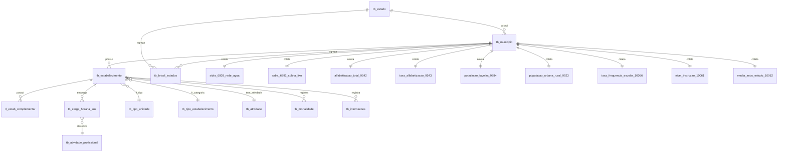

# 🧾 Documentação do Modelo de Dados - CNES, IBGE, SIM, SIH (Projeto TCC)

Este modelo relacional organiza dados públicos para análise de disparidades regionais na oferta de serviços de saúde nos municípios brasileiros. Ele consolida tabelas do CNES (estabelecimentos, leitos, profissionais), SIDRA/IBGE (indicadores socioeconômicos), SIM (mortalidade) e SIH (informações hospitalares), permitindo análises com base municipal ou estadual.

---

## 🗂️ Estrutura de Tabelas

### 📍 Localização

#### `tb_estado`
Armazena as Unidades da Federação.
- `uf`: Sigla da UF (PK)
- `sigla`: Código da UF
- `descricao`: Nome do estado

#### `tb_municipio`
Dados básicos dos municípios.
- `cod_mun`: Código do município (PK)
- `nome_mun`
- `uf`: Chave estrangeira para `tb_estado.uf`
- `populacao`: População total
- `densidade_demog`: Densidade demográfica

#### `tb_brasil_estados`
Estatísticas do IBGE por município.
- `cod_municipio`: Chave primária e FK para `tb_municipio.cod_mun`
- `uf`: FK para `tb_estado.uf`
- Indicadores: população residente, área territorial, escolarização, IDHM, receitas/despesas, PIB per capita, etc.

---

### 🏥 Estrutura de Estabelecimentos de Saúde

#### `tb_estabelecimento`
Contém as informações dos estabelecimentos de saúde.
- `unidade_id`: PK
- `cnes`: Código CNES do estabelecimento
- `codmungest`: Município de gestão (FK para `tb_municipio.cod_mun`)
- `uf`: Estado (FK para `tb_estado.uf`)
- `tp_unid_id`: FK para `tb_tipo_unidade`
- `co_tipo_estabelecimento`: FK para `tb_tipo_estabelecimento`
- `co_atividade_principal`: FK para `tb_atividade`

#### `rl_estab_complementar`
Leitos hospitalares por estabelecimento.
- `unidade_id`: FK para `tb_estabelecimento.unidade_id`
- `qtde_exist`: Quantidade total de leitos
- `qtde_sus`: Quantidade de leitos SUS

#### `tb_tipo_unidade`
Tipos de unidade (hospital, UBS, etc).
- `tp_unid_id`: PK
- `descricao`

#### `tb_tipo_estabelecimento`
Tipos de estabelecimento de saúde.
- `co_tipo_estabelecimento`: PK
- `ds_tipo_estabelecimento`

#### `tb_atividade`
Atividade principal do estabelecimento.
- `co_atividade`: PK
- `ds_atividade`
- `ds_conceito_atividade`

---

### 👩‍⚕️ Profissionais de Saúde

#### `tb_carga_horaria_sus`
Profissionais alocados nos estabelecimentos.
- `prof_id`: PK
- `unidade_id`: FK para `tb_estabelecimento`
- `cod_cbo`: FK para `tb_atividade_profissional`
- Carga horária ambulatorial, hospitalar, outros

#### `tb_atividade_profissional`
Detalhes do CBO de profissionais.
- `cod_cbo`: PK
- `descricao`
- `tp_classificacao_profissional`
- `tp_cbo_saude`

---

### ⚰️ Tabela de Óbitos

#### `tb_mortalidade`
Dados da declaração de óbito (SIM).
- `codestab`: FK para `tb_estabelecimento.cnes`
- `codmunocor`: FK para `tb_municipio.cod_mun`
- `dtobito`: Data do óbito
- `lococor`: Local de ocorrência

---

### 🏨 Internações Hospitalares (SIH/SUS)

#### `tb_internacoes`
Internações hospitalares extraídas do Sistema de Informações Hospitalares do SUS (SIH/SUS).

- `cnes`: FK para `tb_estabelecimento.cnes`
- `data_internacao`: Data de início da internação
- `data_alta`: Data de alta hospitalar
- `sexo`: Sexo do paciente
- `idade`: Idade do paciente
- `diagnostico_principal`: Código CID-10 do diagnóstico principal
- `procedimento`: Código do procedimento realizado
- `tipo_alta`: Tipo de alta hospitalar (ex: cura, óbito, transferência)
- `valor_total`: Valor total da internação

---

### 🌱 Saneamento e Infraestrutura Básica (SIDRA)

#### `sidra_6803_rede_agua`
- `cod_mun`: PK e FK para `tb_municipio`
- `possui_ligacao`: Domicílios com ligação à rede de água
- `nao_possui`: Domicílios sem ligação

#### `sidra_6892_coleta_lixo`
- `cod_mun`: PK e FK para `tb_municipio`
- `total`, `coletado`: Dados sobre destino do lixo

---

### 📚 Indicadores Educacionais e Demográficos (SIDRA)

#### `alfabetizacao_total_9542`
- `cod_municipio`: PK e FK
- `total_alfabetizadas`
- `total_nao_alfabetizadas`

#### `taxa_alfabetizacao_9543`
- `cod_municipio`: PK e FK
- `taxa_alfabetizacao`

#### `populacao_favelas_9884`
- `cod_municipio`: PK e FK
- `total`: População residente em favelas

#### `populacao_urbana_rural_9923`
- `cod_municipio`: PK e FK
- `urbana`, `rural`

#### `taxa_frequencia_escolar_10056`
- `cod_municipio`: PK e FK
- `taxa_frequencia`

#### `nivel_instrucao_10061`
- `cod_municipio`: PK e FK
- `total`: Pessoas por nível de instrução

#### `media_anos_estudo_10062`
- `cod_municipio`: PK e FK
- `media_anos_estudo`

---

## 🔗 Relacionamentos Chave

---

## 📌 Observações

- Todos os nomes seguem padrão `snake_case` e estão tratados para uso direto no DuckDB e Python (Polars, Pandas).
- A tabela `tb_brasil_estados` complementa `tb_municipio` com mais indicadores sociais e econômicos.
- É possível integrar esse modelo com visualizações (Power BI, Superset, Streamlit).
- Ideal para análises com técnicas de clusterização, UMAP, análise regional e detecção de outliers.
